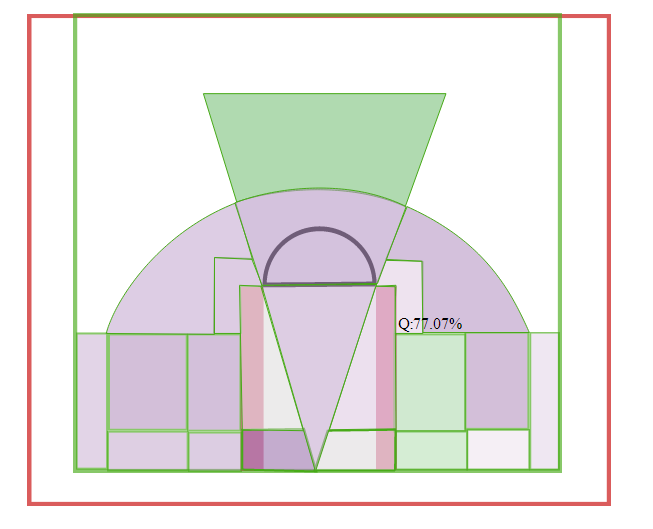

rCharts_basketball
==================

Very crude prototype in response to a [tweet](https://twitter.com/DSMok1">@DSMok1</a> <a href="https://twitter.com/timelyportfolio">@timelyportfolio</a> would be especially impressed if there&#39;s a way to create basketball shot charts (have the image)
&mdash; Krishna Narsu (@knarsu3) <a href="https://twitter.com/knarsu3/statuses/441672978267668481).

<blockquote class="twitter-tweet" lang="en">
<a href="https://twitter.com/abresler">@abresler</a> <a href="https://twitter.com/DSMok1">@DSMok1</a> <a href="https://twitter.com/timelyportfolio">@timelyportfolio</a> would be especially impressed if there&#39;s a way to create basketball shot charts (have the image)
&mdash; Krishna Narsu (@knarsu3) <a href="https://twitter.com/knarsu3/statuses/441672978267668481">March 6, 2014</a></blockquote>

Purpose of this repo is to demo both the capabilities of [d3](http://d3js.org)/svg and how to access those powerful abilities with [rCharts](http://rcharts.io/gallery).  Start to finish from nothing only took about 2 hours.  Given a day, this could be a really neat little chart.

[Live example](http://timelyportfolio.github.io/rCharts_basketball)    
[Sample R code](./code.R)

### Screenshot

